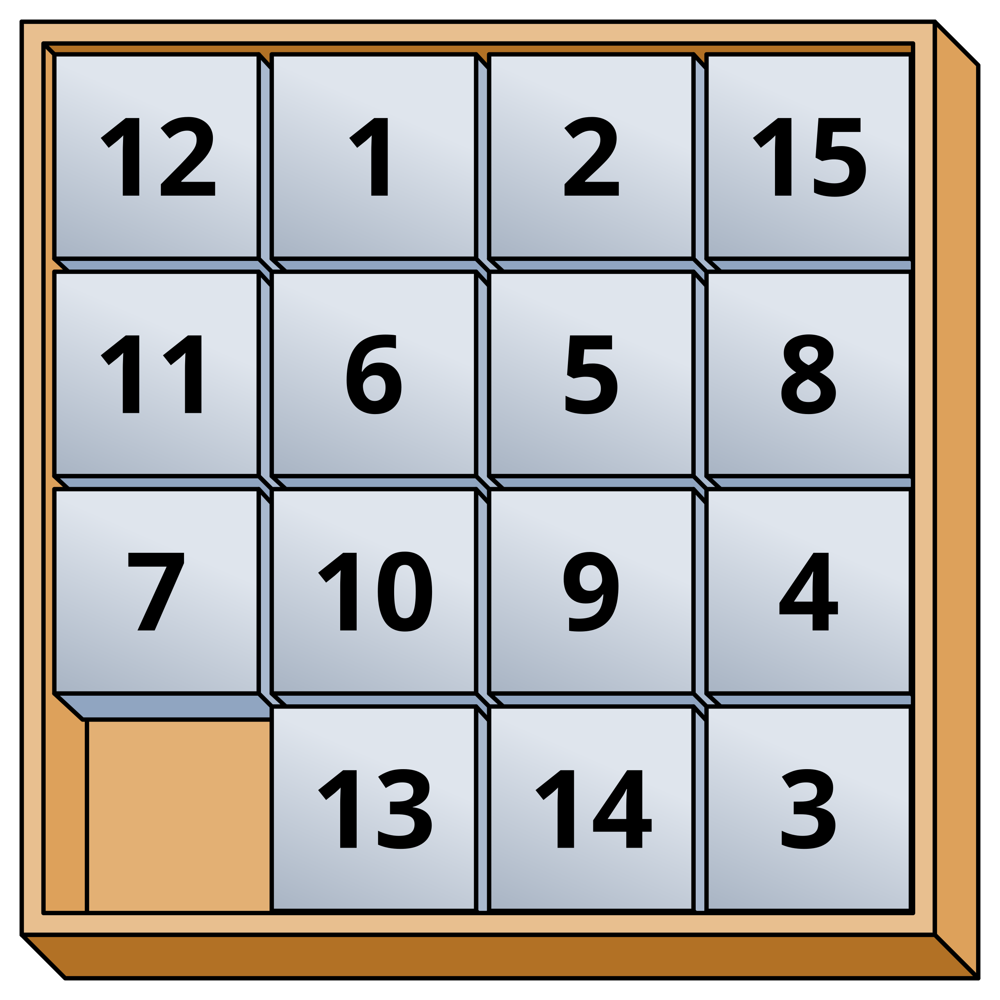
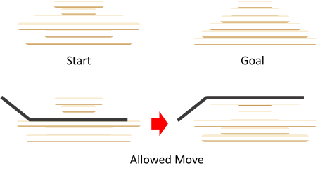

# Extensions of a Bucket-Based Priority Queue 

This project is a C++ reimplementation and extension of [A Bucket-Based Priority Queue for Bounded-Suboptimal and Anytime A* Search](https://ojs.aaai.org/index.php/SOCS/article/view/35976) by Fereday and Hansen. 

The focus of this repository is to demonstrate the performance advantages of bucket-based data structures in heuristic search, specifically for algorithms that require frequent reordering of the open list (such as ANA*). This project also extends the bucket heap to support secondary bucket aggregation and real-valued weights, improving a weakness of the data structure in environments with sparse h-costs. 

## Overview


### Algorithms

#### A\* (```include/algorithms/a_star.h```):

A standard best-first search algorithm designed to find the optimal path from a start node to a goal node. Expands nodes in order of $f(n)=g(n)+h(n)$, ensuring that the first time a goal is expanded, the path found is optimal.

#### Anytime A\* (```include/algorithms/anytime_a_star.h```): 

An anytime variant that quickly finds a suboptimal solution and iteratively improves it. Relies on a $w$-weighted heuristic $f(n)=g(n)+w⋅h(n)$. Once an initial solution is found, it uses the "incumbent" (the best solution found so far) to prune the search space.

#### Anytime Non-parametric A\* (```include/algorithms/ana_star.cpp```):

An anytime search algorithm that adapts its greediness dynamically without requiring a fixed weight parameter. Instead of $f(n)$, ANA* expands nodes that maximize the probability of improving the current solution, defined by the priority function:

$$E(n)=\frac{G_{upper}​−g(n)}{h(n)}​$$

This effectively prioritizes nodes that have the greatest potential to reduce the current best cost ($G_{upper}$​).

### Data Structures

#### Binary Heap (```include/queues/binary_heap.h```):

#### Indexed Binary Heap (```include/queues/indexed_binary_heap.h```):

#### Bucket Queue (```include/queues/bucket_queue.h```):


#### Two-Level Bucket Queue (```include/queues/two_level_bucket_queue.h```):

#### Bucket Heap (```include/queues/bucket_heap.h```):


### Environments

#### Grid Environment (```include/environments/environment.h``` and ```src/grid_environment.cpp```):

A 4-connected implicit graph where the state space consists of cells in a 2D grid of size $W \times H$. Movement is restrict to the cardinal directions, and each cell has an integer traversal cost sampled from $U\{1, 10\}$. Additionally, 20% of the cells are non-traversable. The heuristic used is the Manhattan Distance:

$$h(n) = |x_{goal} - x_n| + |y_{goal} - y_n|$$

#### Sliding Tile Puzzle (```include/environments/environment.h``` and ```src/sliding_tile_environment.cpp```):

A 15-puzzle ($4 \times 4$ grid) focused on moving tiles into a specific goal configuration. The heuristic used is the Manhattan Distance summed across all times relative to their target positions in the goal state. 


To solve the puzzle, the numbers must be rearranged into numerical order from left to right, top to bottom.

#### Pancake Puzzle (```include/environments/environment.h``` and ```src/pancake_environment.cpp```):

A classic combinatorial search problem involving the sorting of a stack of $N$ pancakes. A state is a permutation of the numbers 1 through $N$. A successor is generated by "flipping" the top $k$ pancakes (where $2\leq k \leq N$), which reverses the order of the first $k$ elements in the array. The heuristic used is the Gap Heuristic, which counts the number of non-adjacent values in the current stack. For any index $i$, a gap exists if $|stack[i] - stack[i + 1]| > 1$. 


### Architecture

### Optimizations

## Installation

```bash
git submodule update --init --recursive
```

## Future Work

- Hybrid Expansion Strategy Demo

TODO: 
Figure out full structure/where things are handled in codebase


## License
This project is licensed under the MIT License - see the `License.md` file for details.